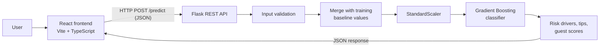

# Hotel Booking Cancellation Prediction System

**Hotel Booking Cancellation Prediction and Guest Experience Analytics Platform.** A React + Flask web app that predicts whether a hotel booking will be cancelled. It explains *why*, suggests what to do about it, and scores the guest experience.

The model is trained on the [Hotel Booking Demand dataset](https://doi.org/10.1016/j.dib.2018.11.126) (Antonio, Almeida & Nunes, 2019): 119,390 real bookings from a city hotel and a resort hotel in Portugal.

---

## Features

| Page | What it does |
|---|---|
| **Home** | Project overview, live dataset and model numbers, quick links |
| **Prediction** | Enter six booking details and get the cancellation risk in real time |
| ↳ *Why this risk?* | Shows which details push the risk up or down, compared with a typical booking |
| ↳ *Recommended actions* | Practical next steps for the front desk (deposit, reminders, overbooking…) |
| ↳ *Quick samples* | One-click demo bookings: Safe guest, Risky booking, Loyal regular, Far-ahead online, Summer family |
| **Guest Analytics** | Guest satisfaction score, repeat booking likelihood and loyalty tier, with the full calculation shown |
| **Dashboard** | Interactive charts on 119k bookings: cancellation by lead time, deposit, month, segment… plus model comparison, feature importance and confusion matrix |
| **Compare** | Two bookings side by side, highlighting the more reliable one |
| **History & Batch** | Every prediction is saved in the browser (export to CSV). Upload a CSV to score up to 1,000 bookings at once |
| **Report** | Download a one-page PDF report for any prediction |
| **Dark mode** | Light/dark theme toggle (remembers your choice) |
| **Responsive** | Works on desktop, tablet and phone |

## Architecture



1. The React form collects the booking details and sends them as JSON to the Flask backend.
2. The backend validates the values. Any field not supplied is filled with the typical booking's value (median / most common value from training).
3. Features are put in the training column order and scaled with the saved `StandardScaler`.
4. The trained model returns the cancellation probability.
5. The backend adds the risk level, risk drivers, recommended actions and guest experience scores.
6. The frontend shows the classification, the probabilities and the explanation.

## Tech stack

- **Frontend:** React 19, TypeScript, Vite, Chart.js (`react-chartjs-2`), jsPDF
- **Backend:** Python, Flask, Flask-CORS
- **Machine learning:** scikit-learn (Logistic Regression, Random Forest, Gradient Boosting), pandas, NumPy, joblib

## Project structure

```
Hotel-Booking-Cancellation-Prediction-system/
├── backend/
│   ├── app.py               Flask REST API (/predict, /predict/batch, /stats, /health)
│   ├── train_model.py       Data cleaning, training, model comparison, saves artifacts
│   ├── features.py          Feature list, category encodings, input validation
│   ├── insights.py          Guest satisfaction, repeat likelihood, recommended actions
│   ├── requirements.txt     Python packages (pinned)
│   ├── model/
│   │   ├── booking_cancellation_model.pkl   Trained classifier
│   │   ├── scaler.pkl                       Fitted StandardScaler
│   │   ├── training_medians.pkl             Typical-booking baseline values
│   │   └── model_stats.json                 Dashboard statistics and model metrics
│   └── data/hotels.csv      Dataset (downloaded automatically, not committed)
├── frontend/
│   ├── src/
│   │   ├── App.tsx          Layout, navigation, theme, shared state
│   │   ├── App.css          Component styles      index.css   Design tokens (light/dark)
│   │   ├── components/      FormField, CancellationResult, Gauges, Icon
│   │   ├── pages/           Home, Predict, GuestAnalytics, Dashboard, Compare, History, Report
│   │   └── lib/             api, fields (form + presets), storage, csv, report (PDF), charts, tones
│   └── vite.config.ts       Dev server + proxy to Flask
├── samples/sample_bookings.csv   25 real bookings for the batch-upload demo
├── setup.bat                One-time setup (Windows)
└── start.bat                Starts backend + frontend and opens the browser (Windows)
```

## Setup and running

### Requirements
- Python 3.10 or newer
- Node.js 20 or newer
- Windows, macOS or Linux, and any modern browser

### Quick start (Windows)
1. Double-click **`setup.bat`** (first time only). It creates the Python environment and installs all packages.
2. Double-click **`start.bat`**. It starts the Flask API and the React app, then opens http://localhost:5173.

### Manual start (any OS)

```bash
# 1. Backend
cd backend
python -m venv .venv
.venv\Scripts\activate            # macOS/Linux: source .venv/bin/activate
pip install -r requirements.txt
python app.py                     # API on http://127.0.0.1:5000

# 2. Frontend (second terminal)
cd frontend
npm install
npm run dev                       # App on http://localhost:5173
```

### Single-command mode
Build the frontend once with `npm run build` in `frontend/`. After that, `python app.py` serves the whole app at **http://127.0.0.1:5000** and npm isn't needed.

### Retraining the model
```bash
cd backend
python train_model.py
```
The dataset is downloaded automatically if `backend/data/hotels.csv` is missing. Training takes about 30 seconds and rewrites everything in `backend/model/`.

## User manual

1. **Launch** the app (see above). The Home page shows the project overview; use the navigation bar to move between pages. The badge in the top-right corner shows whether the model server is online.
2. **Predict a booking:** open **Prediction**, fill in Lead Time, Repeated Guest, Previous Cancellations, ADR, Deposit Type and Total Special Requests, then click **Evaluate Cancellation Risk**. Or click a sample under *Try a sample*. *More booking details* lets you set optional fields such as hotel type, month and market segment.
3. **Read the result:** the gauge shows the cancellation risk and its level (Low < 35% ≤ Medium < 65% ≤ High). *Why this risk?* lists the details that raise (red) or lower (green) the risk compared with a typical booking. *Recommended actions* says what to do.
4. **Guest Analytics:** shows the Predicted Cancellation Risk, Guest Satisfaction Score, Repeat Booking Likelihood and loyalty tier, with the calculation behind each score. Switch bookings with the *Booking* selector.
5. **Dashboard:** hover any chart for exact numbers. The *Model performance* section shows how the three models compare.
6. **Compare:** choose Booking A and Booking B (samples or your history), edit them if you like, and click **Compare**. The more reliable booking is highlighted.
7. **History & Batch:** reopen or delete past predictions, or **Export CSV**. For batch scoring, click **Template** (or use `samples/sample_bookings.csv`), drop the CSV onto the upload area, then **Download results**.
8. **Report:** pick a prediction and click **Download PDF Report**.
9. **Theme:** the sun/moon button switches between light and dark mode.

## API reference

### `POST /predict`
```json
{
  "lead_time": 45,
  "adr": 112.5,
  "deposit_type": "No Deposit",
  "is_repeated_guest": 0,
  "previous_cancellations": 0,
  "total_of_special_requests": 2
}
```
Optional fields: `hotel`, `arrival_date_month` (1-12 or the month name), `stays_in_weekend_nights`, `stays_in_week_nights`, `adults`, `children`, `market_segment`, `customer_type`, `required_car_parking_spaces`, `booking_changes`. Categories can be sent as labels (`"No Deposit"`) or as their codes.

Response (shortened):
```json
{
  "status": "success",
  "outcome": "Confirmed",
  "probabilities": { "Confirmed": 80.92, "Cancelled": 19.08 },
  "risk_level": "Low",
  "drivers": [{ "label": "Special requests", "value": "2", "typical": "0", "impact": -41.4 }],
  "tips": ["Low risk - a standard confirmation email is enough."],
  "guest": { "satisfaction": 71.0, "repeat_likelihood": 60.8, "loyalty_tier": "Promising" }
}
```
Invalid input returns `400` with a message for each field: `{"status": "error", "fields": {"adr": "Average daily rate must be between 0 and 1000"}}`.

### `POST /predict/batch`
`{"bookings": [ {...}, {...} ]}` with up to 1,000 rows. Returns one result per row; rows with invalid values get their own error message and don't stop the others.

### `GET /stats`
Dataset statistics and model metrics used by the dashboard.

### `GET /health`
`{"status": "ok", "model": "Gradient Boosting"}`

## Machine learning model

**Data preparation**
- 119,390 bookings, of which 119,208 are valid: removed bookings with no guests, negative prices and one 5,400 ADR outlier.
- Columns that leak the answer (`reservation_status`, `reservation_status_date`, `assigned_room_type`) and identifiers (`agent`, `company`, `country`) are not used.
- For training, exact duplicate rows are removed (87,228 unique bookings). Otherwise the same booking can land in both the training and test sets and inflate the scores. The dashboard still counts every booking.
- 20 features. Categories are label-encoded with fixed mappings (`features.py`), then everything goes through `StandardScaler`.
- 80/20 stratified train/test split.

**Model comparison** (on 17,446 test bookings the models never saw)

| Model | Accuracy | Precision | Recall | F1 | ROC-AUC |
|---|---|---|---|---|---|
| Logistic Regression | 77.6% | 71.0% | 31.4% | 43.5% | 78.5% |
| Random Forest | 81.0% | 73.4% | 48.8% | 58.6% | 84.9% |
| **Gradient Boosting (selected)** | **80.9%** | **72.0%** | **50.4%** | **59.3%** | **84.8%** |

Gradient Boosting is selected for the best **F1 score**. Only about 27% of unique bookings cancel, so F1 (the balance between catching cancellations and avoiding false alarms) is a fairer yardstick than accuracy. The saved model is only 0.4 MB.

**Monotonic constraints:** the model is told that risk can only go *up* with lead time and previous cancellations, and only *down* with special requests, being a repeat guest, previous completed stays, parking requests and booking changes. These match the patterns in the data and stop the model from reacting erratically to rare values (e.g. 2 special requests scoring riskier than 1).

**Most important features** (permutation importance): lead time, parking spaces, market segment, special requests, average daily rate.

**Risk drivers ("Why this risk?")**: for each detail that differs from a typical booking, the API measures how the risk changes when (a) that detail is reset to typical, and (b) only that detail is applied to a typical booking. The average of the two is shown in percentage points.

## Guest experience scores

The dataset has no review scores, so these are transparent rule-based indicators built from booking signals:

- **Guest Satisfaction Score** (0-100): starts at 55; +8 per special request (up to 3), +10 returning guest, +5 parking booked, +2 per previous completed stay (up to 5); −6 per previous cancellation (up to 3), −5 if the booking sat on the waiting list.
- **Repeat Booking Likelihood** (0-100): 40% × (100 − cancellation risk) + 40% × satisfaction, +20 returning guest, +5 for direct or corporate bookings.
- **Loyalty tier:** Loyal (≥ 75), Promising (50-75), At risk (< 50).

## Integration testing

| Module | Connected with | Result |
|---|---|---|
| React frontend | Flask API (`/predict`, `/predict/batch`, `/stats`) | Successful |
| Flask API | Serialized model, scaler and baseline (`.pkl`) | Successful |
| Backend | Prediction engine + insights | Successful |
| Backend | JSON response, field-level validation errors | Successful |
| Frontend | Result display, charts, PDF report, CSV import/export | Successful |
| Frontend | Backend offline → clear "start the Flask backend" message | Successful |

## Troubleshooting

- **"API offline" / "Cannot reach the prediction server":** the Flask backend isn't running. Start it with `python app.py` in `backend/` (or use `start.bat`).
- **"Model not loaded":** run `python train_model.py` in `backend/`.
- **Port already in use:** close the other program using port 5000 or 5173, or stop old terminals.

## Dataset credit
Nuno Antonio, Ana de Almeida, Luis Nunes. *Hotel booking demand datasets.* Data in Brief, Volume 22, 2019, pages 41-49.
